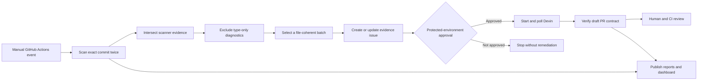

<!--
Licensed to the Apache Software Foundation (ASF) under one
or more contributor license agreements.  See the NOTICE file
distributed with this work for additional information
regarding copyright ownership.  The ASF licenses this file
to you under the Apache License, Version 2.0 (the
"License"); you may not use this file except in compliance
with the License.  You may obtain a copy of the License at

  http://www.apache.org/licenses/LICENSE-2.0

Unless required by applicable law or agreed to in writing,
software distributed under the License is distributed on an
"AS IS" BASIS, WITHOUT WARRANTIES OR CONDITIONS OF ANY
KIND, either express or implied.  See the License for the
specific language governing permissions and limitations
under the License.
-->

# Devin maintenance automation for Apache Superset

[](https://github.com/elizabethmoonw/superset-maintainability-automation/actions/workflows/maintenance-scan.yml)
[](https://elizabethmoonw.github.io/superset-maintainability-automation/)
[](https://docs.devin.ai/api-reference/overview)

[Knip](https://knip.dev/) traverses the TypeScript import and export graph to find unused-code candidates. This proof of concept turns those candidates into bounded maintenance work: a deterministic control plane scans and batches them, Devin investigates the surrounding code and produces a tested draft pull request, and a human decides whether to merge it.

**[View the dashboard](https://elizabethmoonw.github.io/superset-maintainability-automation/)** · **[Run the workflow](https://github.com/elizabethmoonw/superset-maintainability-automation/actions/workflows/maintenance-scan.yml)** · **[Read the architecture](#how-it-works)** · **[Review the metric semantics](#observability-what-the-numbers-mean)**

> **Implementation status:** The scanner, batching, approval boundary, Devin API client, pull-request validation, Docker dispatcher, tests, historical backfill, and dashboard are implemented. The corrected scanner and metrics pipeline have been exercised locally. Before final submission, this repository still needs a recorded end-to-end run in which Devin produces a draft remediation PR from the corrected evidence model.

## How it works



The workflow is [`.github/workflows/maintenance-scan.yml`](.github/workflows/maintenance-scan.yml). It runs only when a person dispatches it; no schedule is enabled.

### Evidence model

At a high level, removal candidates are the eligible code left after subtracting code reachable from every known source of use:

```math
\text{Removal candidates}
=
\text{Eligible code}
-
\mathrm{Reach}\left(
\begin{array}{l}
\text{Application entry points} \\
\cup\ \text{Framework entry points} \\
\cup\ \text{Tests and UI examples} \\
\cup\ \text{Developer tools} \\
\cup\ \text{Public APIs} \\
\cup\ \text{Explicit keep list}
\end{array}
\right)
```

Knip supplies the static part of this calculation by traversing imports and exports from configured entry points. In this proof of concept, those entry points include the production application, tests, and UI examples. Devin then checks repository context that a static traversal may not resolve, such as dynamic loading or framework registration.

Type-only findings remain diagnostic context and are not sent to Devin. The remaining candidates become the bounded batch that Devin investigates before proposing removal in a draft pull request.

Each run offers one file-coherent batch targeting 10 non-type findings. Findings from the same file remain together, and a durable ledger rotates deferred groups and skips groups with open remediation pull requests.

The protected `maintenance-approval` environment is the cost and safety boundary. After approval, the job revalidates the repository, commit, workflow run, batch state, and SHA-256 digest. Devin must return an open draft pull request linked to the evidence, and the automation never merges it.

## Run a real remediation

The canonical path is the GitHub Actions workflow. It uses live repository state, creates a real issue, and consumes Devin Agent Compute Units (ACUs) only after a reviewer approves the batch.

### One-time setup

1. Fork this repository and enable GitHub Actions.
2. Add two repository secrets:
   - `DEVIN_API_KEY`: service-user API key generated in Devin for this automation.
   - `DEVIN_ORG_ID`: organization ID shown on Devin's **Settings → Service Users** page.
3. Create a GitHub environment named `maintenance-approval` and assign at least one required reviewer.
4. Enable GitHub Pages and select **GitHub Actions** as its source.
5. Optional: set `DEVIN_MAX_ACU_LIMIT`. The workflow defaults to `50` ACUs per approved session.

The other optional controls are `DEVIN_POLL_INTERVAL_MS` (default: `10000` milliseconds), `DEVIN_TIMEOUT_MS` (default: `3600000` milliseconds), and `MAINTENANCE_MAX_BATCHES_PER_RUN` (required value: `1` in this implementation).

### Start with Docker

The Docker entrypoint dispatches the real GitHub workflow; it does not substitute a simulated Devin client. Create a fine-grained GitHub token with **Actions: write** access to the fork, then run:

```bash
cd maintenance-automation
cp .env.example .env
# Set GITHUB_TOKEN, GITHUB_REPOSITORY, and MAINTENANCE_WORKFLOW_REF in .env.

docker compose --env-file .env build live
docker compose --env-file .env run --rm live
```

The container prints the workflow URL. The scan and issue creation run in GitHub Actions, then the job waits at `maintenance-approval`. Devin credentials remain in GitHub repository secrets and are not passed to Docker.

### Or start from GitHub

1. Open **[Actions → Maintenance scan](https://github.com/elizabethmoonw/superset-maintainability-automation/actions/workflows/maintenance-scan.yml)**.
2. Select **Run workflow**, choose the branch to scan, and start the run.

### Approve and review either path

1. Review the generated maintenance issue and its attached evidence. No Devin session exists yet.
2. In the waiting workflow run, select **Review deployments**, choose `maintenance-approval`, and approve the deployment.
3. Follow the Devin session through the issue and Actions summary.
4. Review the resulting draft pull request, its tests, and any unresolved findings. Merge or close it manually.

Re-running the same batch reuses its recorded session instead of paying for a duplicate dispatch.

## Observability: what the numbers mean

> **[Open the live dashboard →](https://elizabethmoonw.github.io/superset-maintainability-automation/)**
>
> GitHub Pages shows the latest completed workflow deployment. If its labels differ from the corrected semantics below, run the workflow once to publish the corrected dashboard schema.

### Six-month trend

The dashboard backfills one scanner snapshot per month for six months using the present scanner configuration. Those historical findings were **not actioned**: no issues, Devin sessions, or remediation pull requests were created for them. The line therefore shows how the detection surface changed over time, not automation throughput or code the system would have removed.

### Latest single-scan snapshot

The counts below all come from one corrected local scan at commit [`ec204014f5`](https://github.com/elizabethmoonw/superset-maintainability-automation/commit/ec204014f5c9f5ee0ea6b73c9dc49fbfe42d3753). They are neither cumulative nor six-month totals:

> **757** raw production signals → **530** signals also unused when tests and Storybook are included → **327** non-type removal candidates across **162** paths → **10** findings offered for review

The scan that included tests and Storybook produced 541 signals, and 203 of the 530 shared signals were type-only diagnostics excluded from remediation batches. These figures describe scanner reduction and batch selection; they do not measure how many candidates Devin will ultimately propose for removal.

Each workflow run also writes a GitHub Actions summary and uploads the normalized reports used to build the dashboard. The dashboard answers four leadership questions:

| Question                           | Metric                                     | Meaning                                                                                                                                                                   |
| ---------------------------------- | ------------------------------------------ | ------------------------------------------------------------------------------------------------------------------------------------------------------------------------- |
| Is the detection surface changing? | Non-type review paths over time            | Distinct paths containing shared file, export, or enum-member signals under one consistent scanner configuration. This measures candidate volume, not validated removals. |
| Is the system moving work?         | Batches offered and draft PRs produced     | Workflow-created units that reached the approval and remediation stages.                                                                                                  |
| Are humans accepting the work?     | Merged versus closed-unmerged workflow PRs | Final outcomes only for PRs created by this automation. A historical hand-picked PR is evidence that the problem exists, not evidence of system performance.              |
| Is the system healthy?             | Run state and failure signals              | Whether scans, approval, Devin polling, and PR verification completed or failed.                                                                                          |

The backfill is reconstructed with present dependencies and configuration, so dependency or build-system drift can affect historical snapshots. Effectiveness measures—precision, code removed, engineering time saved, and pull-request acceptance—require completed workflow runs and final human decisions.

## Repository layout

| Path                                                                                  | Responsibility                                                                                   |
| ------------------------------------------------------------------------------------- | ------------------------------------------------------------------------------------------------ |
| [`.github/workflows/maintenance-scan.yml`](.github/workflows/maintenance-scan.yml) | Event, issue creation, approval gate, Devin lifecycle, artifact publication, and PR verification |
| [`src/cli.ts`](maintenance-automation/src/cli.ts)                                                            | Reproducible Knip scans and normalized reports                                                   |
| [`src/generateActionableBatch.ts`](maintenance-automation/src/generateActionableBatch.ts)                    | Evidence intersection, diagnostic separation, and run artifacts                                  |
| [`src/batchLedger.ts`](maintenance-automation/src/batchLedger.ts)                                            | Batch rotation and durable attempt state                                                         |
| [`src/devinApi.ts`](maintenance-automation/src/devinApi.ts)                                                  | Devin API session creation, polling, prompt construction, and status artifacts                   |
| [`src/dispatchWorkflow.ts`](maintenance-automation/src/dispatchWorkflow.ts)                                  | Authenticated GitHub workflow dispatch used by the live Docker entrypoint                        |
| [`src/observabilityBackfill.ts`](maintenance-automation/src/observabilityBackfill.ts)                        | Historical consistent-ruler backfill                                                             |
| [`src/observabilityDashboard.ts`](maintenance-automation/src/observabilityDashboard.ts)                      | Static dashboard generation                                                                      |
| [`Dockerfile`](maintenance-automation/Dockerfile) and [`compose.yml`](maintenance-automation/compose.yml)                           | Reproducible live dispatcher and containerized test runner                                       |
| [`reports/`](maintenance-automation/reports/)                                                                | Example scan, batch, status, and dashboard artifacts                                             |

## Reproduce the scanner locally (optional)

With Docker:

```bash
cd maintenance-automation
docker compose --profile scan run --rm --build scan
```

The scan image installs the pinned frontend and automation dependencies, runs both scanner configurations, and writes the generated evidence to `maintenance-automation/reports/` through a bind mount.

Without Docker:

### Prerequisites

- Git
- Node.js `v24.16.0`, matching [`superset-frontend/.nvmrc`](superset-frontend/.nvmrc)
- npm
- Enough memory and disk space to install and scan the Superset frontend

From the repository root:

```bash
cd maintenance-automation
npm ci
npm test -- --runInBand
npm run build

cd ../superset-frontend
npm ci

cd ../maintenance-automation
npm run scan:both
npm run compare
```

These commands reproduce the scanner evidence and comparison in `reports/`. They do not create a GitHub issue or start Devin; use the GitHub Actions path above for a real remediation.

To generate a local batch after the scans:

```bash
export MAINTENANCE_STARTED_AT="$(date -u +'%Y-%m-%dT%H:%M:%SZ')"
export GITHUB_RUN_ID="local-run"
export GITHUB_REPOSITORY="elizabethmoonw/superset-maintainability-automation"
export GITHUB_SHA="$(git -C .. rev-parse HEAD)"
export MAINTENANCE_WORKFLOW_URL="local://maintenance-scan"
export MAINTENANCE_ARTIFACT_NAME="maintenance-scan-local"
npm run batch:generate
```

Inspect these outputs:

- `reports/actionable-batch.json`: selected and deferred finding groups
- `reports/run-status.json`: workflow-compatible state and immutable identifiers
- `reports/maintenance-summary.md`: concise technical summary
- `reports/remediation-issue.md`: issue body that the GitHub workflow publishes

## Build the dashboard locally

From `maintenance-automation/`, after installing both automation and frontend dependencies:

```bash
npm run observability:site
```

Open `reports/site/index.html` in a browser. This command backfills six months of scanner history and regenerates the dashboard; it can take several minutes because it scans historical commits.

## Test and verification commands

From `maintenance-automation/`:

```bash
npm test -- --runInBand
npm run build
npm run scan:both
npm run compare
npm run observability:site
```

The implemented Jest suite contains 168 tests covering parsing, filtering, batching, ledger behavior, GitHub workflow dispatch, Devin API behavior, PR validation inputs, observability data, backfill, and dashboard generation. Run the same suite in Docker with:

```bash
docker compose --profile test run --rm --build test
```

## Known limitations and next steps

The proof of concept deliberately keeps the control plane small, but these gaps matter before production use:

1. Run and record a corrected end-to-end workflow that produces a Devin draft PR; retain its issue, Actions run, PR, tests, and human outcome as demo evidence.
2. Add a scheduled monthly trigger after the approval, cost, and failure-handling behavior has been validated.
3. Add runtime import or coverage evidence to reduce uncertainty from dynamic loading.
4. Measure precision after human review: verified findings divided by investigated findings.
5. Measure delivered impact after merges: files or exports safely removed, review time, cycle time, and CI outcomes.
6. Add entry points for other repository tooling that may reference frontend code.
7. Apply repository branch protections and required CI checks to Devin PRs.

## Upstream project

This repository is based on [Apache Superset](https://github.com/apache/superset). The maintenance automation is a project-specific addition and is not an Apache Superset feature.
